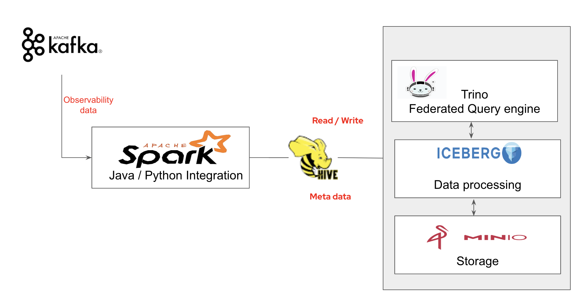

### Data Ingestion from kafka to Mino S3 with Pyspark & Iceberg.


## Introuction about demo.

How to stream data from Kafka brocker and ingest streaming data to S3 object storage using iceberg .




The followoing components involved for this demo and deployed as docker compose 
    Spark - pyspark
    Hive metastore 
    Postrgres DB
    Iceberg
    Minio
    Minio client
    Kafka 

### running the demo locally

```bash
   docker compose build
   docker compose up
    ```

login to jupyter notebook , and run iceberg - minio integration demo located in notebook folder

localhost:4041